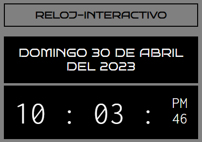

- Digital Clock created with html, css and javascript, the latter defines a function called "updateTime" that updates the time displayed in the App, obtains the current date and time using the "Date" object, and then extracts the hour, minute , second, day of month, month and year, also creates arrays for the names of the days of the week and months. the function then updates various HTML elements on the page with the current date and time, and formats the time in a 12-hour format with an AM/PM indicator

- For the correct operation of the clock, the jQuery library included with a link in the head is used to update the application in real time.

🔗 <a href="https://marceloadan73.github.io/Clock-Js/">See in operation</a>
